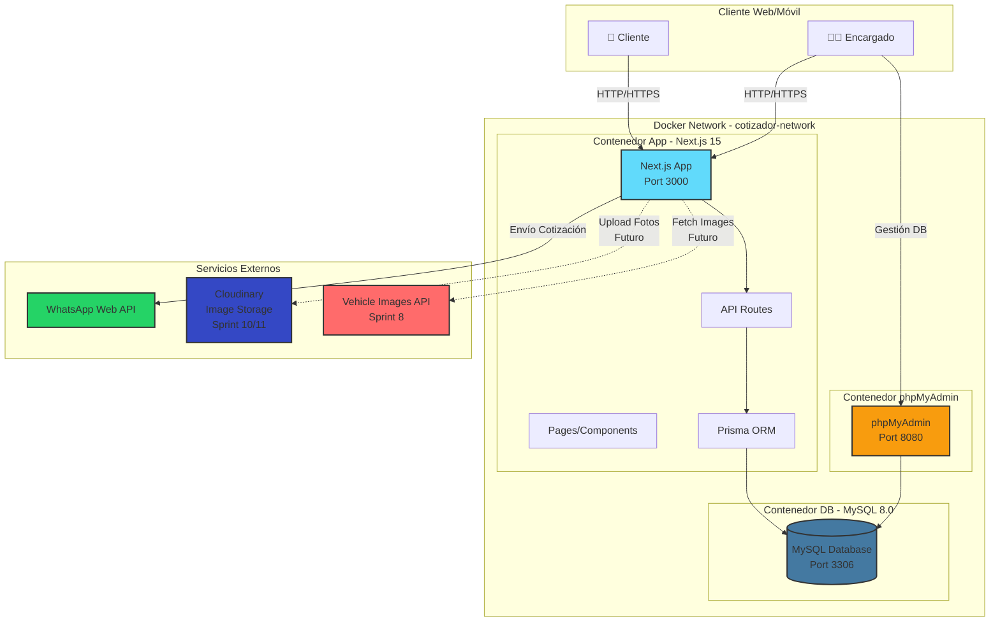
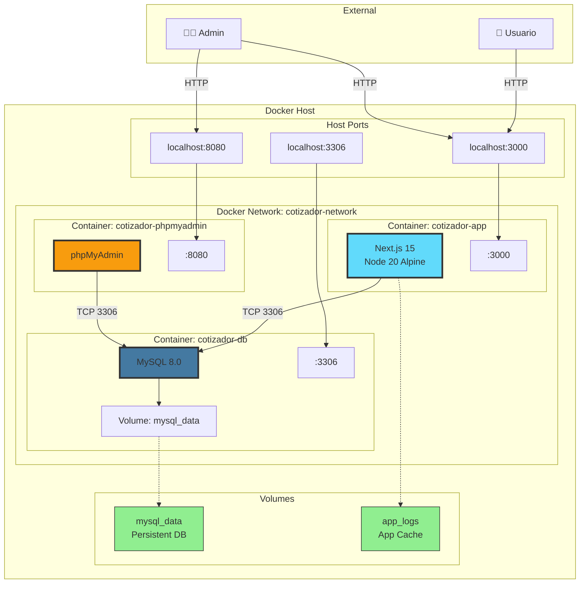
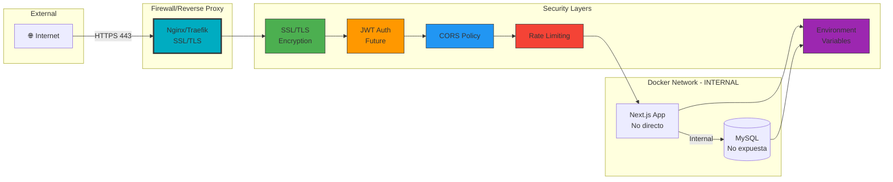
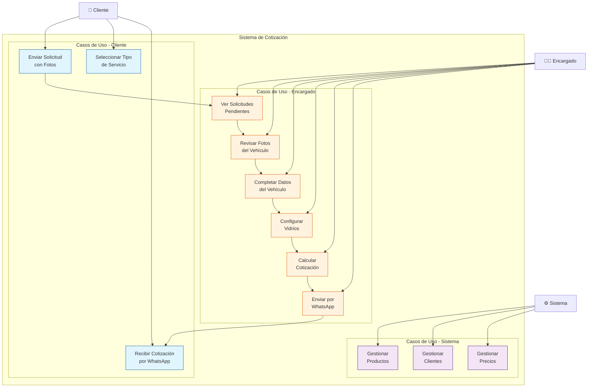
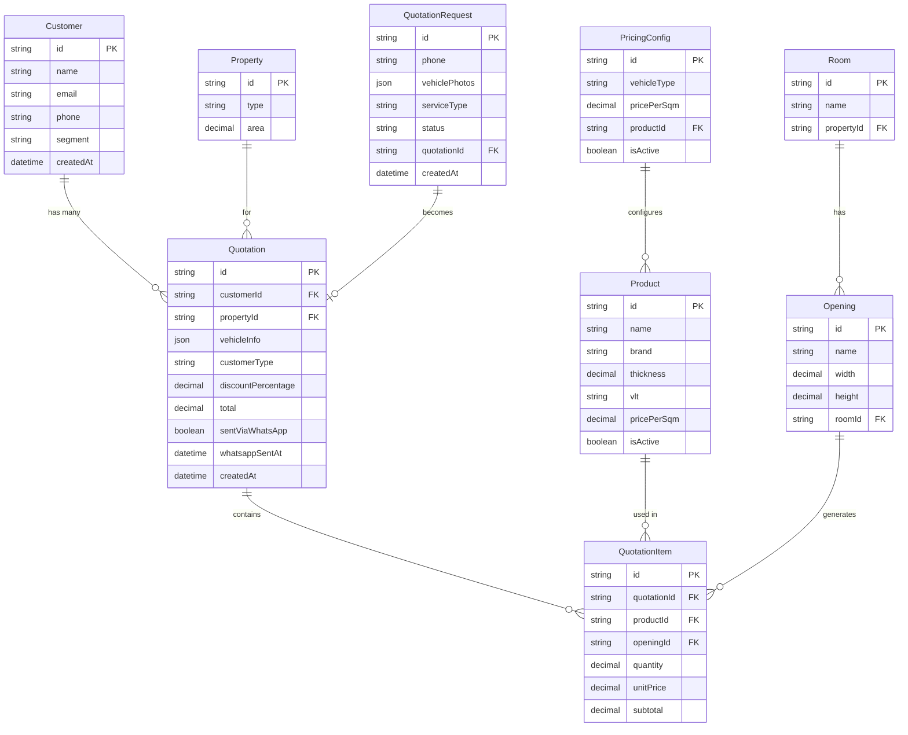
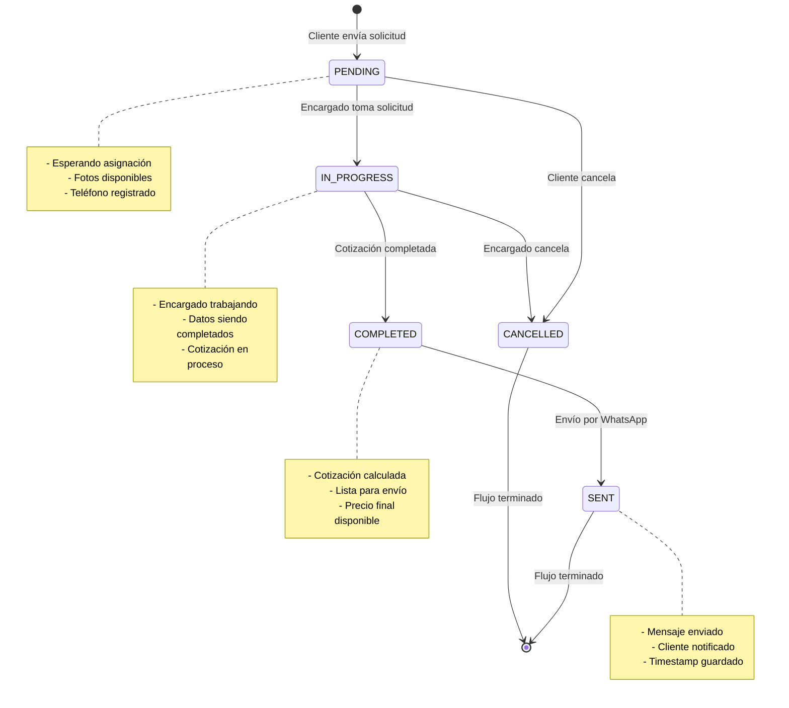
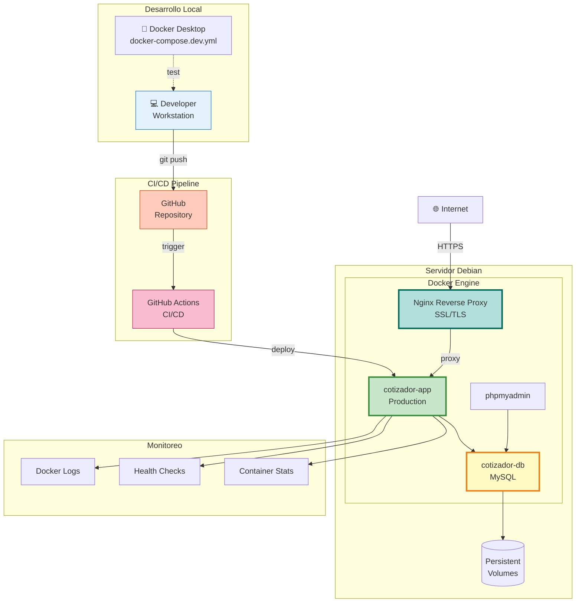

# 🏗️ Arquitectura del Sistema - Cotizador de Láminas

Este documento describe la arquitectura completa del sistema de cotización de láminas para vehículos.

---

## 📊 Diagrama de Arquitectura General



---

## 🔄 Diagrama de Flujo de Datos

```mermaid
flowchart LR
    subgraph "Cliente"
        C1[📱 Formulario<br/>Simplificado]
        C2[📸 Fotos del<br/>Vehículo]
    end

    subgraph "API Layer"
        API1[/api/solicitudes]
        API2[/api/whatsapp/send]
        API3[/api/health]
    end

    subgraph "Base de Datos"
        DB1[(QuotationRequest)]
        DB2[(Quotation)]
        DB3[(Customer)]
        DB4[(Product)]
    end

    subgraph "Encargado"
        M1[📋 Panel de<br/>Solicitudes]
        M2[✏️ Completar<br/>Cotización]
        M3[📤 Enviar<br/>WhatsApp]
    end

    C1 --> API1
    C2 --> API1
    API1 --> DB1

    DB1 --> M1
    M1 --> M2
    M2 --> DB2
    M2 --> DB3
    DB4 --> M2

    M3 --> API2
    API2 -->|Mensaje<br/>Formateado| WhatsApp[💬 WhatsApp]

    style C1 fill:#e3f2fd,stroke:#1976d2
    style C2 fill:#e3f2fd,stroke:#1976d2
    style M1 fill:#fff3e0,stroke:#f57c00
    style M2 fill:#fff3e0,stroke:#f57c00
    style M3 fill:#fff3e0,stroke:#f57c00
    style WhatsApp fill:#c8e6c9,stroke:#388e3c
```

---

## 🧩 Diagrama de Componentes

```mermaid
graph TB
    subgraph "Frontend - Next.js App Router"
        subgraph "Cliente Pages"
            P1[/cotizar/cliente]
        end

        subgraph "Encargado Pages"
            P2[/encargado/solicitudes]
            P3[/encargado/cotizaciones/nueva]
        end

        subgraph "Shared Pages"
            P4[/cotizar/vehiculos]
        end

        subgraph "Components"
            C1[VehicleForm]
            C2[OpeningConfigurator]
            C3[QuotationSummary]
            C4[PhotoUpload]
        end
    end

    subgraph "Backend - API Routes"
        subgraph "Solicitudes API"
            A1[GET /api/solicitudes]
            A2[POST /api/solicitudes]
            A3[GET /api/solicitudes/:id]
            A4[PATCH /api/solicitudes/:id]
        end

        subgraph "WhatsApp API"
            A5[POST /api/whatsapp/send]
        end

        subgraph "System API"
            A6[GET /api/health]
        end
    end

    subgraph "Data Layer - Prisma"
        subgraph "Models"
            M1[QuotationRequest]
            M2[Quotation]
            M3[QuotationItem]
            M4[Customer]
            M5[Product]
            M6[PricingConfig]
        end

        subgraph "Database"
            DB[(MySQL 8.0)]
        end
    end

    subgraph "Utilities"
        U1[lib/vehicleImages.ts]
        U2[lib/prisma.ts]
        U3[lib/whatsapp.ts]
    end

    P1 --> C4
    P1 --> A2
    P2 --> A1
    P3 --> A3
    P4 --> C1
    P4 --> C2
    P4 --> C3
    P4 --> A5

    C1 --> U1
    C4 --> U1

    A1 --> M1
    A2 --> M1
    A3 --> M1
    A4 --> M1
    A5 --> M2
    A5 --> U3

    M1 --> DB
    M2 --> DB
    M3 --> DB
    M4 --> DB
    M5 --> DB
    M6 --> DB

    U2 --> DB

    style P1 fill:#e1bee7,stroke:#8e24aa
    style P2 fill:#ffccbc,stroke:#d84315
    style P3 fill:#ffccbc,stroke:#d84315
    style P4 fill:#c5e1a5,stroke:#558b2f
    style DB fill:#b3e5fc,stroke:#0277bd
```

---

## 🐳 Diagrama de Infraestructura Docker



---

## 🔐 Diagrama de Seguridad



---

## 📱 Diagrama de Casos de Uso



---

## 🗄️ Diagrama del Modelo de Datos



---

## 🔄 Diagrama de Estados (Solicitud)



---

## 🚀 Diagrama de Deployment



---

## 📊 Resumen de Componentes

### Frontend
- **Framework**: Next.js 15 (App Router)
- **UI**: React 19 + TailwindCSS
- **Iconos**: Lucide React
- **Formularios**: React Hooks

### Backend
- **Runtime**: Node.js 20
- **API**: Next.js API Routes
- **ORM**: Prisma
- **Base de Datos**: MySQL 8.0

### Infraestructura
- **Containerización**: Docker + Docker Compose
- **Web Server**: Next.js Standalone (Producción)
- **DB Admin**: phpMyAdmin
- **Reverse Proxy**: Nginx (Producción)

### Integraciones
- **WhatsApp**: Web API (actual) → Business API (futuro)
- **Imágenes**: Placeholders (actual) → Cloudinary (futuro)
- **Vehículos**: Local (actual) → API externa (Sprint 8)

---

**Última actualización**: Enero 2025
**Versión**: Sprint 7.5
